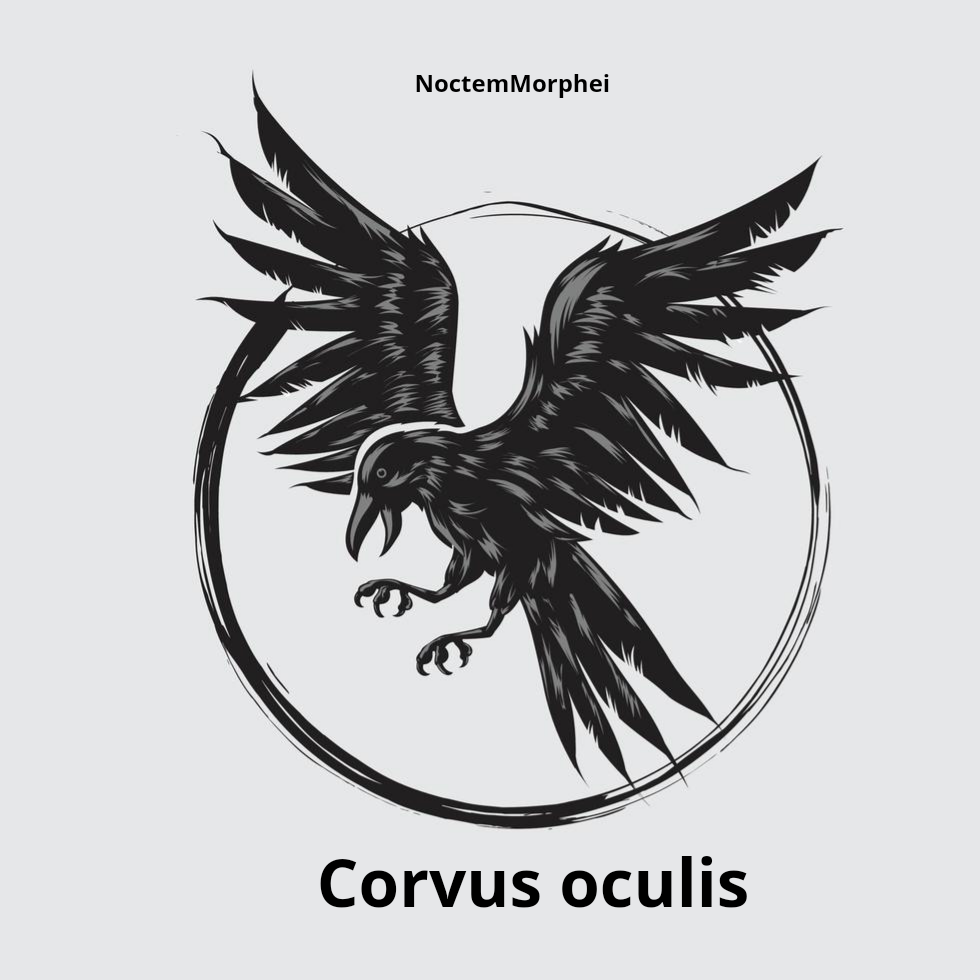

  

## corvus oculis
 corvus oculis, uma ferramenta feita em python com objetivo de encontrar dados,falhas e informações restritas e específicas em sites do Google

## 🥽 testado em

✔TERMUX

✔Kali ou Kali Linux

## 📋 Pré-requisitos

ter o python3 e git clone instalados

## 🔧 instalação no termux/Kali ou Kali Linux
https://github.com/NoctemMorphei/Dorking-corvus-oculis/

cd Dorking-corvus-oculis

pip install pystyle

python corvus.py

## ⚙️ executar a ferramenta
python Corvus.py
